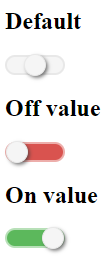

# React toggle candlestick (version 1.0.0)

Inspired from project [Candlestick](https://github.com/EdouardTack/candlestick)

This is a switch and stylish React component that create checkbox into toggle switch button. This plugin allows to choose between three options. The toggle button switch with CSS animation.



## Install

`npm install react-candlestick --save`

## Usage

You have to import/require the library like this.

```javascript
// import usage
import Candlestick from 'react-candlestick';
// OR
// require usage
const Candlestick = require('react-candlestick');
```

and then use it in react component. It will create an input[type=hidden] with the value.

```javascript
const options = {
    id: 'candlestick',
    defaultValue: '',
    choices: [1, 0, ''],
    onChange: (value) => {
        console.log(value);
    }
};

<Candlestick { ...options } />
```

## Options


| Name | Type | Default | Usage |
|:-----:|:-----:|:-----:|:-----:|
| id | string | Generate random string | Name for input[hidden] |
| defaultValue | string OR number | empty | Value by default |
| choices | array<onValue, offValue, neutralValue> | [1, 0, ''] | Different values |
| onChange | function | (value) => {} | Fired after change value |


## Development

Create some files

`public/index.html`
```html
<!DOCTYPE html>
<html lang="en">
  <head>
    <meta charset="utf-8" />
    <meta name="viewport" content="width=device-width, initial-scale=1" />
    <title>Candlestick development</title>
  </head>
  <body>
    <div id="root"></div>
</body>
</html>
```

`src/App.js`
```javascript
import React from 'react';
import Candlestick from './Candlestick';

function App() {
    return (
        <div>
            <form action="" onSubmit={submit}>
                <h2>Default</h2>
                <Candlestick />
            </form>
        </div>
    );
}

export default App;

```

`src/index.js`
```javascript
import React from 'react';
import ReactDOM from 'react-dom';
import App from './App';

ReactDOM.render(<App />, document.getElementById('root'));
```

`npm run start` to launch a react localhost to develop.

# CHANGELOG

[SEE CHANGELOG](./CHANGELOG.md)

## LICENCE

MIT License

Copyright (c) 2020 Tackacoder

Permission is hereby granted, free of charge, to any person obtaining a copy
of this software and associated documentation files (the "Software"), to deal
in the Software without restriction, including without limitation the rights
to use, copy, modify, merge, publish, distribute, sublicense, and/or sell
copies of the Software, and to permit persons to whom the Software is
furnished to do so, subject to the following conditions:

The above copyright notice and this permission notice shall be included in all
copies or substantial portions of the Software.

THE SOFTWARE IS PROVIDED "AS IS", WITHOUT WARRANTY OF ANY KIND, EXPRESS OR
IMPLIED, INCLUDING BUT NOT LIMITED TO THE WARRANTIES OF MERCHANTABILITY,
FITNESS FOR A PARTICULAR PURPOSE AND NONINFRINGEMENT. IN NO EVENT SHALL THE
AUTHORS OR COPYRIGHT HOLDERS BE LIABLE FOR ANY CLAIM, DAMAGES OR OTHER
LIABILITY, WHETHER IN AN ACTION OF CONTRACT, TORT OR OTHERWISE, ARISING FROM,
OUT OF OR IN CONNECTION WITH THE SOFTWARE OR THE USE OR OTHER DEALINGS IN THE
SOFTWARE.


This project was bootstrapped with [Create React App](https://github.com/facebook/create-react-app).

## Available Scripts

In the project directory, you can run:

### `yarn start`

Runs the app in the development mode.<br />
Open [http://localhost:3000](http://localhost:3000) to view it in the browser.

The page will reload if you make edits.<br />
You will also see any lint errors in the console.

### `yarn test`

Launches the test runner in the interactive watch mode.<br />
See the section about [running tests](https://facebook.github.io/create-react-app/docs/running-tests) for more information.

### `yarn build`

Builds the app for production to the `build` folder.<br />
It correctly bundles React in production mode and optimizes the build for the best performance.

The build is minified and the filenames include the hashes.<br />
Your app is ready to be deployed!

See the section about [deployment](https://facebook.github.io/create-react-app/docs/deployment) for more information.

### `yarn eject`

**Note: this is a one-way operation. Once you `eject`, you can’t go back!**

If you aren’t satisfied with the build tool and configuration choices, you can `eject` at any time. This command will remove the single build dependency from your project.

Instead, it will copy all the configuration files and the transitive dependencies (Webpack, Babel, ESLint, etc) right into your project so you have full control over them. All of the commands except `eject` will still work, but they will point to the copied scripts so you can tweak them. At this point you’re on your own.

You don’t have to ever use `eject`. The curated feature set is suitable for small and middle deployments, and you shouldn’t feel obligated to use this feature. However we understand that this tool wouldn’t be useful if you couldn’t customize it when you are ready for it.

## Learn More

You can learn more in the [Create React App documentation](https://facebook.github.io/create-react-app/docs/getting-started).

To learn React, check out the [React documentation](https://reactjs.org/).

### Code Splitting

This section has moved here: https://facebook.github.io/create-react-app/docs/code-splitting

### Analyzing the Bundle Size

This section has moved here: https://facebook.github.io/create-react-app/docs/analyzing-the-bundle-size

### Making a Progressive Web App

This section has moved here: https://facebook.github.io/create-react-app/docs/making-a-progressive-web-app

### Advanced Configuration

This section has moved here: https://facebook.github.io/create-react-app/docs/advanced-configuration

### Deployment

This section has moved here: https://facebook.github.io/create-react-app/docs/deployment

### `yarn build` fails to minify

This section has moved here: https://facebook.github.io/create-react-app/docs/troubleshooting#npm-run-build-fails-to-minify
